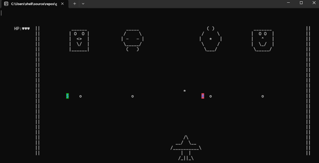

# Assembly Language Final Project -  Space Shooting Game
group 24: 陳孟蓉、劉姸廷、江玉如、郭語婕

This is a 2D Space Shooting Game developed in x86 Assembly Language using the Irvine32 library.
The player controls a spaceship, defeats enemies, avoids dangers, and tries to survive as long as possible.

The project demonstrates fundamental assembly programming concepts, including:

- Keyboard input handling
- Real-time object movement
- Collision detection
- Health system implementation
- Game state control

## How to Play

### Start the Game
Press **SPACE** to start the game.

### Controls
- **Arrow Keys** → Move the spaceship (Up / Down / Left / Right)
- **SPACE** → Shoot bullets

---

## Game Mechanics

- Enemies will continuously appear and attack the player.
- The player can shoot bullets to eliminate enemies.
- Avoid enemy bullets and falling bombs.

### Health System
- The player starts with a limited number of lives.
- **Green Bomb** → Gain **+2 lives**
- **Red Bomb** → Lose **1 life**
- The game ends when all lives are lost.

---

## Win / Lose Conditions

- **Win**: Defeat enemies and survive until the victory condition is achieved.
- **Lose**: Player HP reaches 0.

